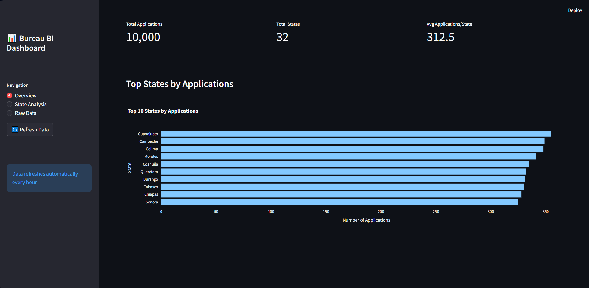
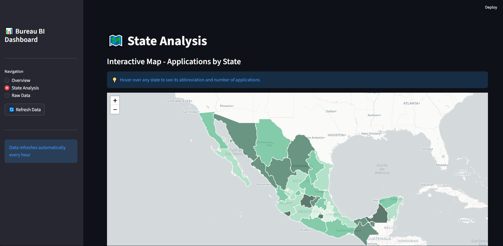
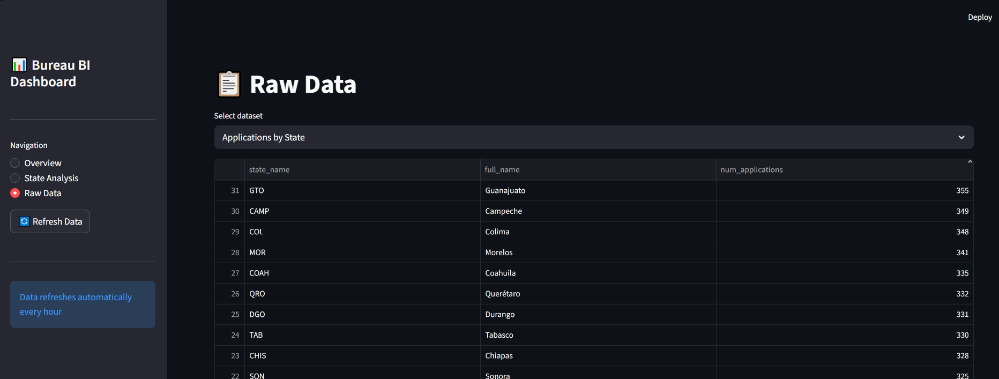

# 🏦 de-bureau-project
### A Data Engineering Pipeline for Credit Bureau Analytics

> 🎓 This project was built as a capstone for the **[Data Engineering Zoomcamp 2026 Cohort](https://github.com/DataTalksClub/data-engineering-zoomcamp)** by DataTalks.Club.
> 
> 👤 **Author:** Carlos Rodriguez

---

## 🌎 Overview

In Latin America, financial institutions rely heavily on credit bureau information to power their loan engines, risk models, and customer analytics. Lenders query bureau services to assess creditworthiness, monitor portfolios, and build machine learning features for predictive scoring.

The challenge: bureau data is typically delivered through web services in **XML or JSON formats** designed for transactional consumption — not analytical processing. These formats are verbose, deeply nested, and unsuitable for direct use in feature engineering, aggregations, or ML pipelines.

This project bridges that gap by building a modern data engineering pipeline that:

- 📥 **Ingests** raw bureau XML responses from Google Cloud Storage
- 🔄 **Loads** them into BigQuery using [dlt](https://dlthub.com/) (data load tool)
- 🛠️ **Transforms** the raw data into analytical layers using [dbt](https://www.getdbt.com/)
- 📊 **Exposes** key metrics and insights through a Streamlit dashboard

The result is a scalable, reproducible pipeline that turns opaque bureau responses into structured, query-ready datasets — enabling credit teams to build better loan decisioning and risk analytics.

---

## 🏗️ Architecture

```
Bureau XML/JSON
      │
      ▼
☁️ Google Cloud Storage (Raw Zone)
      │
      ▼
⚙️  dlt (Ingestion → BigQuery raw dataset)
      │
      ▼
🛠️  dbt (Staging → Intermediate → Marts)
      │
      ▼
📊 Streamlit Dashboard
```

**BigQuery Dataset Hierarchy:**

```
GCP Project          →  Database
└── Dataset          →  Schema
    └── Table        →  Table
```

```
<your-project-id> (Project / Database)
└── Connections (Dataset / Schema)
    ├── raw
    │   ├── applications
    │   ├── consultas
    │   ├── cuentas
    │   ├── domicilios
    │   ├── personas
    │   ├── _dlt_loads
    │   ├── _dlt_pipeline_state
    │   └── _dlt_version
    ├── seeds
    │   └── offices
    ├── staging
    │   ├── stg_applications
    │   ├── stg_consultas
    │   ├── stg_cuentas
    │   ├── stg_domicilios
    │   └── stg_personas
    ├── intermediate
    │   ├── inter_applications_offices
    │   ├── inter_consultas
    │   ├── inter_cuentas
    │   ├── inter_domicilios
    │   └── inter_personas
    └── marts
        ├── dim_offices
        ├── fct_applications_per_state
        ├── fct_count_month_state
        ├── fct_monto_per_state
        ├── fct_num_consultas
        └── fct_num_cuentas_abiertas
```

---

## 📦 Dependencies

Each service has its own isolated Python environment managed with [uv](https://github.com/astral-sh/uv) and declared in a `pyproject.toml`.

### 🏭 Ingestion (`bureau-ingestion`)

```toml
[project]
name = "bureau-ingestion"
version = "0.1.0"
requires-python = ">=3.11,<3.12"
dependencies = [
    "dlt[bigquery]==1.24.0",
    "xmltodict==0.13.0",
    "faker==33.1.0",
    "pandas==2.2.3",
    "google-cloud-storage==2.18.2",
]
```

| Library | Purpose |
|---|---|
| `dlt[bigquery]` | Data load tool — parses and loads data into BigQuery |
| `xmltodict` | Converts bureau XML responses into Python dicts |
| `faker` | Generates synthetic bureau data for testing |
| `pandas` | Data manipulation and transformation |
| `google-cloud-storage` | Reads/writes files to GCS buckets |

### 🛠️ Transformation (`bureau-dbt`)

```toml
[project]
name = "bureau-dbt"
version = "0.1.0"
requires-python = ">=3.11,<3.12"
dependencies = [
    "dbt-core==1.8.9",
    "dbt-bigquery==1.8.3",
]
```

| Library | Purpose |
|---|---|
| `dbt-core` | dbt engine — runs SQL models, tests, and seeds |
| `dbt-bigquery` | BigQuery adapter for dbt |

### 📊 Dashboard (`bureau-streamlit`)

```toml
[project]
name = "bureau-streamlit"
version = "0.1.0"
requires-python = ">=3.11"
dependencies = [
    "streamlit>=1.28.0",
    "pandas>=2.0.0",
    "plotly>=5.17.0",
    "google-cloud-bigquery>=3.11.0",
    "google-auth>=2.23.0",
    "db-dtypes>=1.1.1",
    "folium>=0.15.0",
    "streamlit-folium>=0.15.0",
    "requests>=2.31.0",
]
```

| Library | Purpose |
|---|---|
| `streamlit` | Web dashboard framework |
| `pandas` | Data manipulation for dashboard queries |
| `plotly` | Interactive charts and visualizations |
| `google-cloud-bigquery` | Queries BigQuery datasets |
| `google-auth` | GCP authentication |
| `db-dtypes` | BigQuery-compatible pandas data types |
| `folium` + `streamlit-folium` | Interactive maps for geographic insights |
| `requests` | HTTP calls for external data sources |

---

## ✅ Prerequisites

- 🐳 Docker & Docker Compose
- ☁️ A GCP project with BigQuery and Cloud Storage enabled
- 🔑 A GCP service account with the following roles:
  - `Storage Admin`
  - `BigQuery Admin`

---

## ⚙️ Configuration

### 1. 🔑 Store your GCP Credentials

```bash
mkdir -p ~/.gcp
nano ~/.gcp/credentials.json
# Paste your service account JSON and save (Ctrl+X, Y, Enter)

# Lock down permissions
chmod 600 ~/.gcp/credentials.json
```

### 2. 📝 Create your `.env` file

Create a `.env` file in the project root with the following variables:

```dotenv
GCS_PROJECT=<your-gcp-project-id>
CREDENTIALS_PATH=~/.gcp/credentials.json
SECRETS_PATH=/secrets/credentials.json
STREAMLIT_PASSWORD=admin123
```

> 💡 `CREDENTIALS_PATH` is the path on your **host machine**. `SECRETS_PATH` is where it will be mounted **inside the containers**.

---

## 🚀 Running the Project

### 1. Build and start the services

```bash
cd de-bureau-project

# Build all services
docker compose -f docker-compose.yml build

# Start in detached mode
docker compose up -d
```

---

## 🌍 Infrastructure — Terraform

This project uses **Terraform** to provision a Google Cloud Storage bucket where the bureau XML files will be stored.

Access the ingestion container:

```bash
docker exec -it bureau-ingestion bash
```

Inside the container, initialize and apply the Terraform configuration:

```bash
bash run-terraform.sh init
bash run-terraform.sh plan
bash run-terraform.sh apply
```

A successful apply will output:

```
google_storage_bucket.xmls_bucket: Creating...
google_storage_bucket.xmls_bucket: Creation complete after 2s [id=<bucket_name>]

Apply complete! Resources: 1 added, 0 changed, 0 destroyed.

Outputs:

bucket_name      = "<bucket_name>"
bucket_self_link = "https://www.googleapis.com/storage/v1/b/<bucket_name>"
bucket_url       = "gs://<bucket_name>"
```

---

## 📥 Ingestion

### 1. 🏭 Generate dummy bureau XML files

Since bureau data is confidential, this project includes a producer script that generates synthetic XML files mimicking real bureau responses.

Inside the `bureau-ingestion` container, run:

```bash
python producer_cc.py \
  --files 10000 \
  --applications applications.json \
  --start-date "2023-01-01" \
  --end-date "2025-01-01" \
  --offices offices.csv \
  --zip bureau.zip \
  --gcs-bucket $GCS_BUCKET_NAME \
  --gcs-credentials $SECRETS_PATH
```

### 2. 🗄️ Load data into BigQuery

Once the files are in GCS, run the ingestion script to parse the XML and load it into the BigQuery `raw` dataset:

```bash
python ingestar_circulo_credito.py \
  --zip $GCS_ZIP_URL \
  --applications "gs://${GCS_BUCKET_NAME}/applications.json" \
  --project $GCP_PROJECT \
  --credentials $SECRETS_PATH \
  --disposition "replace"
```

This will create the `raw` dataset in BigQuery with all source tables. 🎉

---

## 🛠️ Transformation — dbt

Access the dbt container:

```bash
docker exec -it bureau-dbt bash
```

### 1. 🌱 Seed reference data

Download the `offices.csv` seed file from GCS and load it into BigQuery:

```bash
bash scripts/seed_from_gcs.sh
```

### 2. ▶️ Run the dbt models

```bash
dbt run
```

This will build all layers — `staging`, `intermediate`, and `marts` — in BigQuery, creating the full analytical dataset. ✨

---

## 📊 Dashboard — Streamlit

Once dbt has finished running, forward port `8501` and open your browser at:

```
http://localhost:8501
```

Use the password defined in your `.env` (`STREAMLIT_PASSWORD`) to log in. 🎉

### 🖥️ App Views

**📈 Overview**


**🗺️ State Analysis**


**🗃️ Raw Data**
